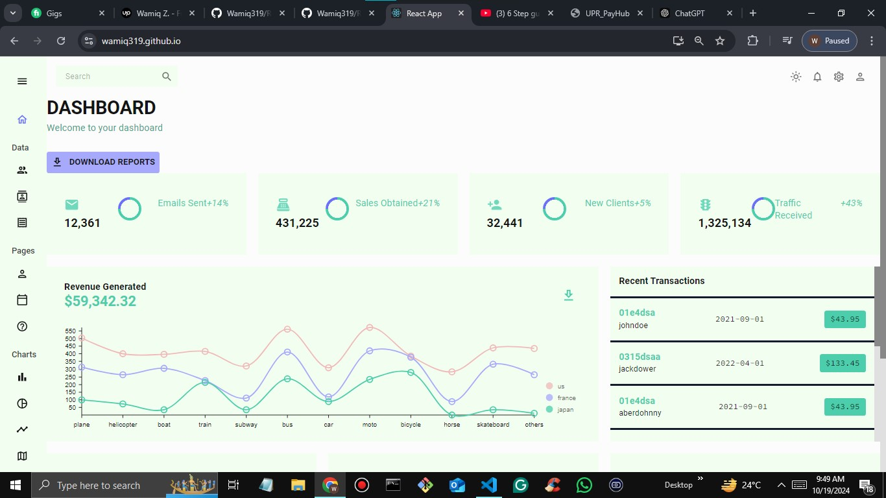

# React Dashboard

A feature-rich React dashboard designed to streamline team management and data visualization. This project aims to address common challenges faced by teams in tracking performance, managing tasks, and visualizing metrics effectively.

## Live Demo

You can view the live demo of the dashboard [here](https://wamiq319.github.io/team).

## Problem Statement

In many organizations, team management and performance tracking can be cumbersome due to:

- **Lack of Visibility:** Team members often struggle to access important metrics and updates.
- **Inefficient Communication:** Teams face challenges in coordinating tasks and sharing progress.
- **Data Overload:** With numerous data sources, visualizing and interpreting relevant information can be overwhelming.

### How This Dashboard Solves Problems

- **Centralized Information:** All essential team metrics are accessible from one place, reducing time spent searching for information.
- **Visual Analytics:** Utilizes charts and graphs to present data clearly, making it easier for team leaders to make informed decisions.
- **Task Management:** Provides tools for assigning and tracking tasks, improving accountability and transparency.

## Features

- **Dynamic Data Visualization:** Interactive charts and graphs for effective data interpretation.
- **User Authentication:** Secure login and registration processes ensure data privacy.
- **Easy Navigation:** Intuitive layout with a sidebar menu for quick access to different sections.

## Screenshots

Here are some screenshots of the dashboard in action:

.jpg)




## Technologies Used

- **React:** Frontend library for building user interfaces.
- **React Router:** For routing and navigation.
- **Chart.js:** For data visualization.
- **CSS:** For styling the components.

## Getting Started

To get a local copy of the project up and running, follow these simple steps:

### Prerequisites

- Node.js and npm must be installed on your machine. You can download it from [Node.js official website](https://nodejs.org/).

### Installation

1. Clone the repository:

   ```bash
 
